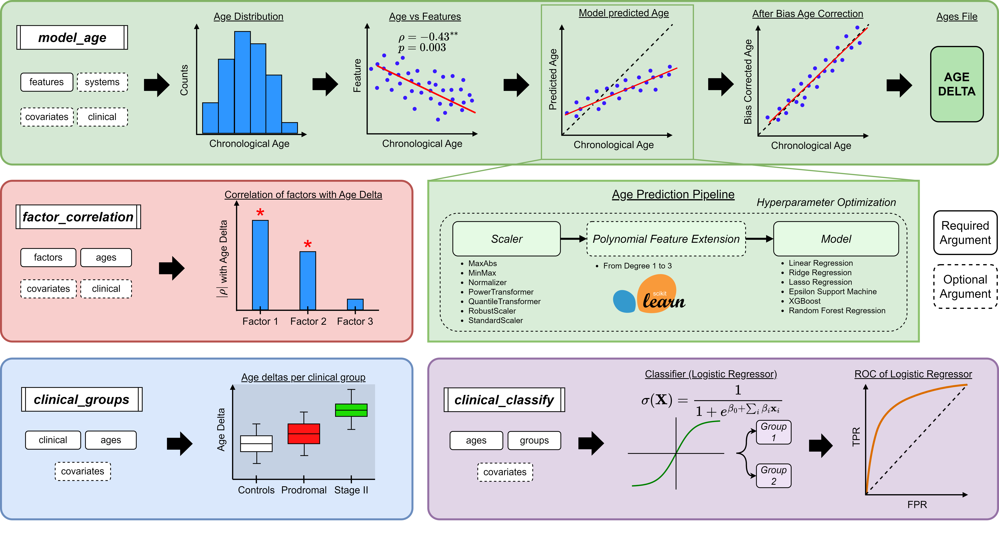

# ageml

`ageml` is a Python package for Age Modelling with Machine Learning made easy.

[](https://zenodo.org/doi/10.5281/zenodo.10255549) [](https://badge.fury.io/py/ageml) 



## Background

Age Modelling consists of trying to predict the chronological age of an organism with a set of features that capture information about its aging status and dynamics.

With a rich feature set one can accurately predict the chronological age of a normative (healthy) population using relatively simple machine learning models. When the feature set is sufficiently rich and the model can capture the complexity of the data, performing inference on non-normative populations leads to prediction errors in their chronological age.

The mismatch between the chronological vs. predicted age (known as _age delta_) is a proxy of aberrant aging trajectories, often having high correlations with factors that condition ageing. Furthermore, classification of different clinical groups (e.g.: stable vs progressive) can also be done using the trained models.

## Our mission

The objective of `ageml` is to standardise procedures, lower the barrier to entry into age modelling and ensure reproducibility. The project is Open-Source to create a welcoming environment and a community to work together to improve and validate existing methodologies. We are actively seeking new developers who want to contribute to growing and expanding the package.


## Our pipelines

`ageml` allows age modelling with a set of simple-to-use pipeliens that produce comprehensive figures of the modelling steps and detailed logs for exploring the effectiveness of the trained models.

There are 4 main pipelines:

- `model_age`: It takes a features file from a set of subjects, including their chronological age, and it trains a regression model on it. Categorical Covariates can be included to train models per category, and 'systems', feature groups that correspond to a congruent physiological system (cardiac, muskuloskeletal, gastric, etc.) can also be included to train models per system. The predicted ages and the corresponding _age delta_ are returned. Also, a simple correlation analysis is performed to check how the input features correlate with the chronological age. The age distribution of the cohort is plotted too.

- `factor_correlation`: The correlation between the provided factors and the computed _age deltas_ is analyzed, including the strength and significance. If the clinical category of each subject is provided, this runs for every clinical category.

- `clinical_groups`: To see how the _age delta_ changes across clinical groups, boxplots are plotted. he age distribution across the groups is also plotted.

- `clinical_classify`: Using the features file and the age deltas, classification of two clinical groups is performed. A Receiver Operating Curve (ROC) is plotted for each model used in the classifications.

**(!) Important**: The last 3 pipelines depend on the output of the `model_age` pipeline, so this one should be run first.

## How to install `ageml`

#### Using `pip` (recommended)

To install the latest version in PyPI, run: `pip install ageml`

#### Cloning from Github

If you want to use the latest cutting-edge version, you can clone the repository and install it locally.

1. From your terminal, run: `git clone https://github.com/compneurobilbao/ageml.git` 
2. `cd` into the `ageml` folder, and install with pip:`pip install .`

Note that `ageml` is under active development, but still not continuously deployed, so the latest version might not be available in PyPI.

#### Docker
There are two Dockerfiles available for `ageml`:
- `./Dockerfile` -> installs `ageml` from PyPI.
  - To build it:
`docker build -t ageml:pip -f Dockerfile <path_to_directory_containing_Dockerfile>`

- `./Dockerfile_latest` -> installs the latest version of `ageml` from the `main` branch of the repository.
  - To build it:
`docker build -t ageml:latest -f Dockerfile <path_to_directory_containing_Dockerfile_latest>`


To run the container, run:
`docker run -it ageml:<tag_of_your_image>`

A developer Dockerfile will be available in the future for contributing to the project in a containerized fashion.

#### Developer installation

The developer installation is described in the [contribution guidelines](./docs/CONTRIBUTING.md).

## How to cite

If you use `ageml` in your work, please cite the all-time:

J. Garcia Condado, I. Tellaetxe Elorriaga, J. M. Cortes, and A. Erramuzpe, ‘AgeML: Age modelling with Machine Learning’. BioRxiv. May 05, 2024. doi: 10.1101/2024.05.02.592130.

```

@article{ageml_2024,
    title = {AgeML: Age modelling with Machine Learning},
    author = {Garcia Condado, Jorge and Tellaetxe Elorriaga, Iñigo  and Cortes, Jesus M. and Erramuzpe, Asier},
    url = {http://biorxiv.org/lookup/doi/10.1101/2024.05.02.592130},
    doi = {10.1101/2024.05.02.592130},
    month = may,
    year = {2024},
}
```

## How to Contribute to the project

We welcome scientists and developers who want to standardize the procedures of age modelling, share pretrained models or whatever other kind of contribution that can help the project. Any contribution is very much appreciated, and we are eager to get you on board!

So, if you want to contribute, please read first the [contribution guidelines](./docs/CONTRIBUTING.md).

## Contact Information

You can email our team at [ageml.py@gmail.com](mailto:ageml.py@gmail.com). We will try to get back at you ASAP!

## License

This project is licensed under the Apache License, Version 2.0 - see the [LICENSE](./LICENSE) file for details.


<!-- References
- De Lange, A.-M. G., & Cole, J. H. (2020). Commentary: Correction procedures in brain-age prediction. NeuroImage: Clinical, 26, 102229. [https://doi.org/10.1016/j.nicl.2020.102229](https://doi.org/10.1016/j.nicl.2020.102229)
- Franke, K., Ziegler, G., Klöppel, S., & Gaser, C. (2010). Estimating the age of healthy subjects from T1-weighted MRI scans using kernel methods: Exploring the influence of various parameters. NeuroImage, 50(3), 883–892. [https://doi.org/10.1016/j.neuroimage.2010.01.005](https://doi.org/10.1016/j.nicl.2020.102229)
- Tian, Y. E., Cropley, V., Maier, A. B., Lautenschlager, N. T., Breakspear, M., & Zalesky, A. (2023). Heterogeneous aging across multiple organ systems and prediction of chronic disease and mortality. Nature Medicine, 29(5), 1221–1231. [https://doi.org/10.1038/s41591-023-02296-6](https://doi.org/10.1016/j.nicl.2020.102229)
 -->