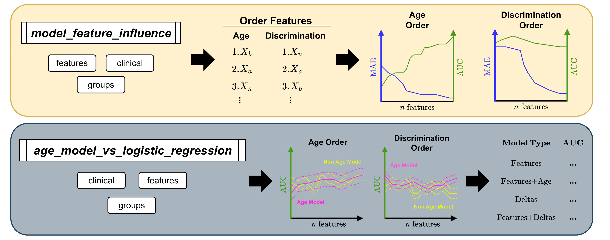

# AgeML: Age modelling with Machine Learning

`ageml` is a Python package for Age Modelling with Machine Learning made easy.

[](https://zenodo.org/doi/10.5281/zenodo.10255549) [](https://badge.fury.io/py/ageml) 

## Description


`ageml` allows age modelling with a set of simple-to-use CLIs that produce comprehensive figures of the modelling steps and detailed logs for exploring the effectiveness of the trained models.

There are 4 main CLIs:

- __model_age__: Trains a model to predict chronological age from features, with optional categorical and system-based covariates, and outputs predicted ages, age deltas, correlation analysis, and distribution plots.
- __factor_correlation__: Analyzes the correlation between provided factors and age deltas, including significance, with optional stratification by clinical category.
- __clinical_groups__: Generates boxplots and age distribution plots to visualize age delta differences across clinical groups.
- __clinical_classify__: Performs classification between two clinical groups using features and age deltas, outputting ROC curves for each model.



There are also 2 extra CLIs:

- __model_feature_influence__ : Analyzes the effect of different feature selection methods when creating deltas that will be used as input in classification tasks.
- __age_model_vs_logistic_regression__: Compares the use of deltas for classification to using the features directly in a logistic regressor. 

## How to use `ageml`

A comprehensive, step by step tutorial of the tool can be found [here](./docs/TUTORIAL.md).
You can also tinker around with our [getting started Colab notebook](https://colab.research.google.com/drive/1FtHbIghXLswG8IcOgFZBHJ07wKnLuzbG) if you want a more interactive experience.

For more indepth discussion on methods see the publication [AgeML: Age modelling with Machine Learning](https://ieeexplore.ieee.org/abstract/document/10844538)

## How to cite

If you use `ageml` in your work, please cite the all-time:

J. Garcia Condado, I. Tellaetxe Elorriaga, J. M. Cortes and A. Erramuzpe, "AgeML: Age modeling with Machine Learning," in *IEEE Journal of Biomedical and Health Informatics*, doi: 10.1109/JBHI.2025.3531017.

```
@article{AgeML,
  title = {{{AgeML}}: {{Age}} Modeling with {{Machine Learning}}},
  shorttitle = {{{AgeML}}},
  author = {Garcia Condado, Jorge and Tellaetxe Elorriaga, Iñigo and Cortes, Jesus M. and Erramuzpe, Asier},
  date = {2025},
  journaltitle = {IEEE Journal of Biomedical and Health Informatics},
  shortjournal = {IEEE J. Biomed. Health Inform.},
  pages = {1--11},
  issn = {2168-2194, 2168-2208},
  doi = {10.1109/JBHI.2025.3531017},
  url = {https://ieeexplore.ieee.org/document/10844538/},
  urldate = {2025-01-29}
}

```

If you also used __model_feature_influence__ or __age_model_vs_logistic_regression__ please cite:

J. Garcia Condado, I. Verdugo Recuero, I. Tellaetxe Elorriaga, C. Birkhenbihl, M. Carrigan, R. Buckley, A. Erramuzpe and J. M. Cortes, "Aging as an active player in Alzheimer's Disease Classification: Insights from feature selection in BrainAge Models," in *MedrXiv*, doi: 10.1101/2025.04.16.25325953

```
@article{condadoAgingActivePlayer2025,
  title = {Aging as an Active Player in {{Alzheimer}}’s {{Disease Classification}}: {{Insights}} from Feature Selection in {{BrainAge Models}}},
  shorttitle = {Aging as an Active Player in {{Alzheimer}}’s {{Disease Classification}}},
  author = {Condado, Jorge Garcia and Recuero, Ines Verdugo and Elorriaga, Iñigo Tellaetxe and Birkhenbil, Colin and Carrigan, Maria and Diez, Ibai and Buckley, Rachel F and Erramuzpe, Asier and Cortes, Jesus M},
  date = {2025-10-21},
  journaltitle = {NeuroImage},
  shortjournal = {NeuroImage},
  pages = {121548},
  issn = {1053-8119},
  doi = {10.1016/j.neuroimage.2025.121548},
  url = {https://www.sciencedirect.com/science/article/pii/S1053811925005518},
  urldate = {2025-10-27},
  keywords = {Alzheimer’s Disease,Brain Age,Machine Learning,Neuroimaging,Neuropsychology},
}

```

## How to install `ageml`

#### Using `pip` (recommended)

From your terminal, for basic installation, run: `pip install ageml`

#### Cloning from Github

Note that `ageml` is under active development, but still not continuously deployed, so the latest version might not be available in PyPI. If you want to use the latest version, you can clone the repository and install it locally. 

From your terminal, run: `git clone https://github.com/compneurobilbao/ageml.git` 
Then `cd` into the `ageml` folder, and install with pip:`pip install .`

#### Docker
There are two Dockerfiles available for `ageml`.
- One that installs `ageml` from pip -> ./Dockerfile
- Another one for the latest version of `ageml`, which installs it from the GitHub repo `main` branch.

To build the pip image, run:
`docker build -t ageml:pip -f Dockerfile <path_to_directory_containing_Dockerfile>`
To build the latest image, run:
`docker build -t ageml:latest -f Dockerfile <path_to_directory_containing_Dockerfile>`

To run the container, run:
`docker run -it ageml:<tag_of_your_image>`

A developer Dockerfile will be available in the future for contributing to the project in a containerized fashion.

#### Developer installation

The developer installation is described in the [contribution guidelines](./docs/CONTRIBUTING.md).

## How to Contribute to the project

We welcome scientists and developers who want to standardize the procedures of age modelling, share pretrained models or whatever other kind of contribution that can help the project.

The contribution guidelines can be found [here](./docs/CONTRIBUTING.md).

## License

This project is licensed under the Apache License, Version 2.0 - see the [LICENSE](./LICENSE) file for details.
