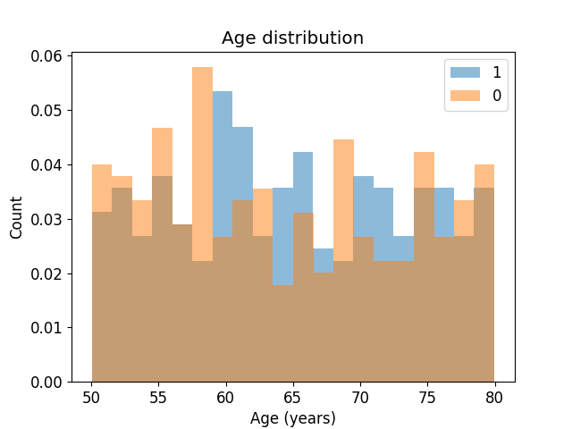
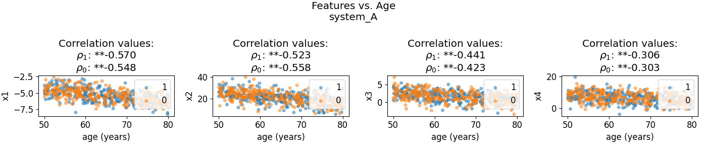
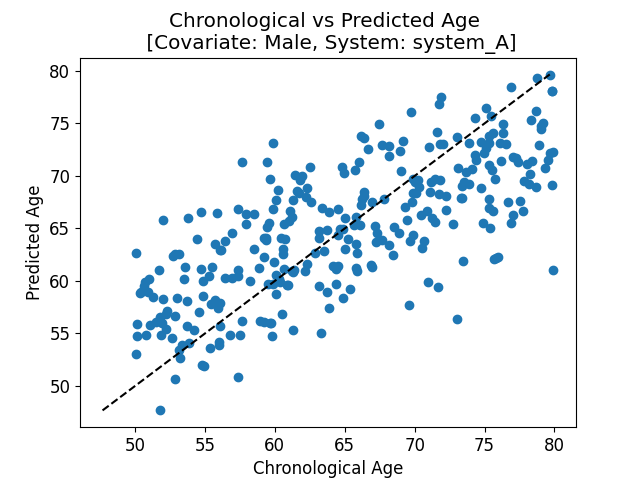
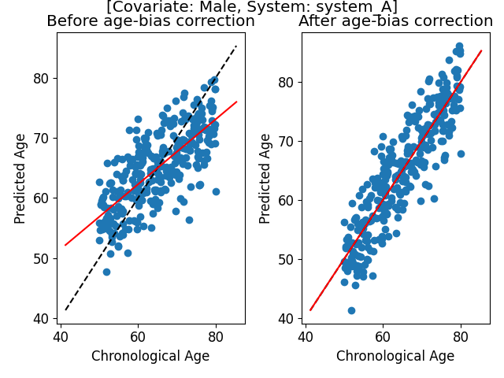
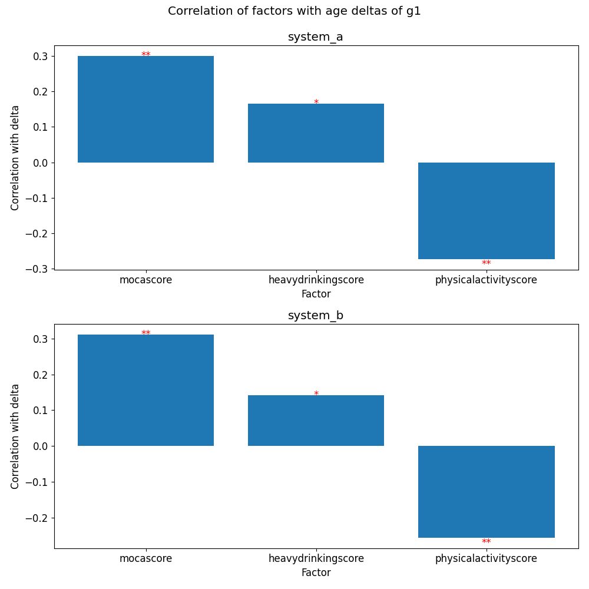
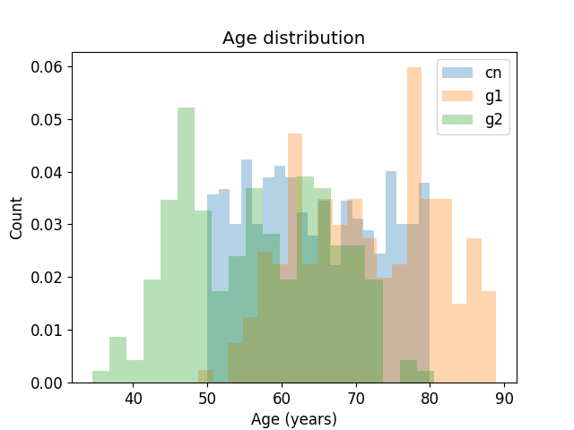
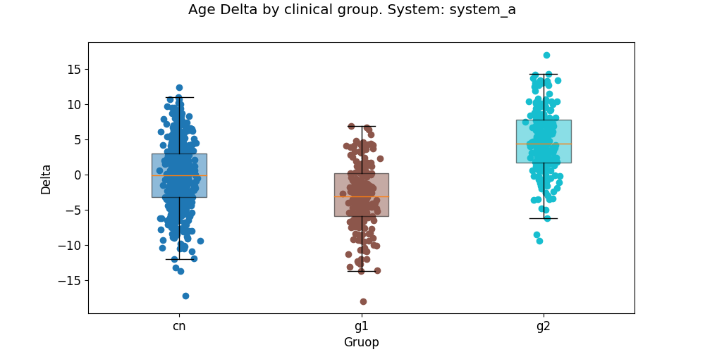
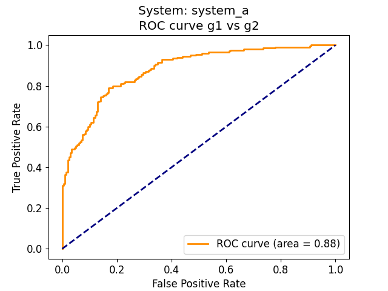
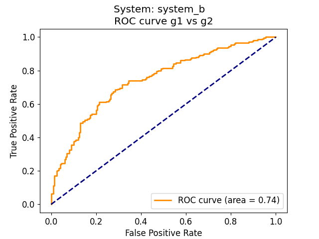
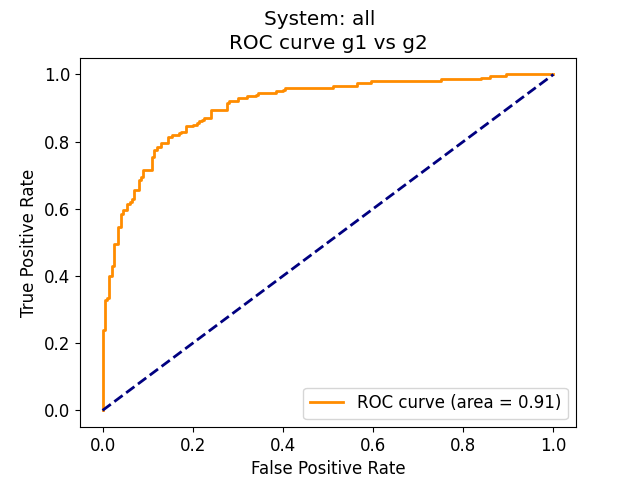

# `ageml` tutorial

This document shows a typical workflow you can follow with `ageml` to analyze your data.

## Prerequisites

### Installation

You should have `ageml` installed in your system. If you don't, please follow the instructions in the [README.md](../README.md) file, on the [How to install ageml](../README.md#how-to-install-ageml) section.

### Data

You should also have a set of basic input files, as specified in the [input file specification](../docs/input_file_specification.md) file, or use the toy datasets provided in the `src/ageml/datasets` folder. This tutorial uses the the toy datasets.

- `features.csv`
- `factors.csv`
- `covariates.csv`, with a covariate column named `biological_gender`
- `clinical.csv`, with two categories, `control` and `patient`
- `systems.txt`, with two systems, `cardiovascular` and `brain`

Note: You can generate the toy datasets in a directory of your choice after installing `ageml` by running the following command: `generate_ageml_data -o <your_output_dir>`

## 1. Model Age

To run the model age pipeline run the following command (assuming you are in the toy dataset directory):

```bash
model_age -o <output_dir> -f toy_features.csv --covariates toy_covar.csv --systems toy_systems.txt --clinical toy_clinical.csv --covar_name <covariate_name>
```

This pipeline will:
1. Plot the chronological age distribution of the control group and test if there are statistically significant differences between clinical group age distributions. If a categorical covariate name is provided in the `--covar_name` argument, the control group will be stratified by the covariate and the age distribution will be plotted for each stratum. The `log.txt` file in the specified output directory `output_dir` contains summary statistics of the age distribution of the control group and the results of the statistical tests.
See below the expected output of the `log.txt` file and the age distribution plot:
    ```
    Age distribution of Controls
    [Group: 1]
    Mean age: 64.88
    Std age: 8.57
    Age range: [50,79]
    [Group: 0]
    Mean age: 64.32
    Std age: 8.96
    Age range: [50,79]
    Checking that age distributions are similar using T-test: T-stat (p_value)
    If p_value > 0.05 distributions are considered simiilar and not displayed...
    ```
    <div style="text-align: center;">  </div> 

2. Compute and plot the correlation of each feature with the chronological age. If a categorical covariate name is provided in the `--covar_name` argument, the correlation will be computed for each stratum of the covariate. If the `--systems` argument is provided, the correlation will be computed for each system. The `log.txt` file in the specified output directory `output_dir` contains the correlation coefficients and the significance of the correlation for each feature.
See below a summary of the expected outputs:
    ```
    Features by correlation with Age of Controls [System: system_A]
    significance: 0.05 * -> FDR, ** -> bonferroni
    Covariate Male
    1.Male ** x1: -0.57 (3.2e-27)
    2.Male ** x2: -0.52 (1.7e-22)
    3.Male ** x3: -0.44 (9.9e-16)
    4.Male ** x4: -0.31 (6.7e-08)
    Covariate Female
    1.Female ** x2: -0.56 (5.6e-26)
    2.Female ** x1: -0.55 (6.8e-25)
    3.Female ** x3: -0.42 (2e-14)
    4.Female ** x4: -0.30 (8.6e-08)
    ```
    <div style="text-align: center;">  </div> 

3. Train a model specified with the `-m` argument to predict the chronological age of the control group using the features. The model is trained using a K-fold cross-validation that you can specify with the `--cv` argument and the performance metrics are reported in the log file per fold. The use of hyperparameter tuning, polynomial feature extension, and feature scalers can also be specified with the `-ht`, `-fext`, and `-s` arguments, respectively.
After training the model, an age-bias correction step is performed, where a linear transformation is applied to the data to fit the $y=x$ line. Also, the age deltas are computed and included in a `predicted_ages_*.csv` file, where the deltas per system are included. **This file is necessary to run the rest of the pipelines**.
    <div style="display: flex; justify-content: center;">
        <div style="margin: 10px;">
            
        </div>
        <div style="margin: 10px;">
            
        </div>
    </div>


## 2. Factor Correlation

To run the factor correlation pipeline run the following command:

```bash
factor_correlation -o <output_dir> -a <output_dir/model_age/predicted_age_*> -f toy_factors.csv --covariates toy_covar.csv --clinical toy_clinical.csv
```

This pipeline will:
1. Apply covariate correction to the factors, if covariates are provided.
2. Compute and plot the correlation between each factor and the age deltas, for every clinical group. If no clinical file is provided, the correlation is computed assuming all subjects are controls. See below the expected output:
    ```
    Correlations between lifestyle factors for g1
    significance: 0.05 * -> FDR, ** -> bonferroni
    System: system_a
    1. ** mocascore: 0.30 (1.5e-05)
    2. ** physicalactivityscore: -0.27 (8.3e-05)
    3. * heavydrinkingscore: 0.16 (0.02)
    System: system_b
    1. ** mocascore: 0.31 (7.1e-06)
    2. ** physicalactivityscore: -0.26 (0.00025)
    3. * heavydrinkingscore: 0.14 (0.046)
    ```
    <div style="text-align: center;">  </div>


## 3. Clinical Groups

To run the clinical groups pipeline run the following command:

```bash
clinical_groups -o <output_dir> -a <output_dir/model_age/predicted_age_*> --clinical toy_clinical.csv --covariates toy_covar.csv
```

This pipeline will:
1. Plot the age distribution of the clinical groups.
2. Test if there are statistically significant differences between the age distributions of the clinical groups
3. Test if there are statistically significant differences between the distributions of the age deltas, across systems. The log file contains summary statistics of the age distribution of the clinical groups age distributions and the results of the statistical tests.
    ```
    Age distribution of Clinical Groups
    [Group: cn]
    Mean age: 64.60
    Std age: 8.77
    Age range: [50,79]
    [Group: g1]
    Mean age: 71.67
    Std age: 9.31
    Age range: [48,88]
    [Group: g2]
    Mean age: 56.61
    Std age: 9.83
    Age range: [34,80]
    Checking that age distributions are similar using T-test: T-stat (p_value)
    If p_value > 0.05 distributions are considered similar and not displayed...
    Age distributions cn and g1 are not similar: -9.70 (4.2e-21)
    Age distributions cn and g2 are not similar: 10.80 (1.8e-25)
    Age distributions g1 and g2 are not similar: 15.68 (1.7e-43)
    -----------------------------------
    Delta distribution for System:system_a
    [Group: cn]
    Mean delta: -0.12
    Std delta: 4.46
    Delta range: [-17, 12]
    [Group: g1]
    Mean delta: -3.12
    Std delta: 4.57
    Delta range: [-17, 6]
    [Group: g2]
    Mean delta: 4.64
    Std delta: 4.66
    Delta range: [-9, 17]
    Checking for statistically significant differences between deltas...
    significance: 0.05 * -> FDR, ** -> bonferroni
    ** p-value between cn and g1: 1.1e-15
    ** p-value between cn and g2: 7.5e-35
    ** p-value between g1 and g2: 3.2e-48
    ```
    <div style="display: flex; justify-content: center;">
        <div style="margin: 10px;">
            
        </div>
        <div style="margin: 10px;">
            
        </div>
    </div>

## 4. `clinical_classify`

To run the clinical classify pipeline run the following command:

```bash
clinical_classify -o <output_dir> -a <output_dir/model_age/predicted_age_*> --clinical toy_clinical.csv --covariates toy_covar.csv --groups <group_A> <group_B>
```

In the toy dataset, for the groups, you can choose between `cn`, `g1`, and `g2`. This pipeline will:

1. Train a Logistic Regressor to classify between the specified groups using the age deltas. If multiple systems are found in the ages file, a model using the deltas of each system is trained, plus a joint model with the deltas of each system. In the joint model, the coefficient computed for each delta is reported, to have a measure of the importance of the feature importance. Training is done using a K-fold cross-validation that you can specify with the `--cv` argument and the performance metrics are reported in the log file after each model is trained. The threshold used in classification and the confidence interval can be specified with the `--threshold` and `--ci` arguments, respectively.
2. Plot a Receiver-Operating Curve (ROC) for each trained model. See below a summary of the results:
    ```
    Classification between groups g1 and g2 [System: system_a]
    Summary metrics over all CV splits (0.95 CI)
    AUC: 0.881 [0.820-0.941]
    Accuracy: 0.795 [0.715-0.875]
    Sensitivity: 0.798 [0.681-0.914]
    Specificity: 0.795 [0.709-0.881]
    -----------------------------------
    Classification between groups g1 and g2 [System: system_b]
    Summary metrics over all CV splits (0.95 CI)
    AUC: 0.749 [0.681-0.818]
    Accuracy: 0.700 [0.619-0.781]
    Sensitivity: 0.680 [0.558-0.801]
    Specificity: 0.725 [0.663-0.787]
    -----------------------------------
    Classification between groups g1 and g2 [System: all]
    Summary metrics over all CV splits (0.95 CI)
    AUC: 0.910 [0.877-0.943]
    Accuracy: 0.825 [0.780-0.870]
    Sensitivity: 0.826 [0.709-0.943]
    Specificity: 0.828 [0.752-0.905]
    Logistic regressor weigths coef (norm_coef):
    delta_system_a = 0.368 (1.000)
    delta_system_b = 0.224 (0.608)
    ```
    <div style="display: flex; justify-content: center;">
        <div style="margin: 10px;">
            
        </div>
        <div style="margin: 10px;">
            
        </div>
        <div style="margin: 10px;">
                
        </div>
    </div>

